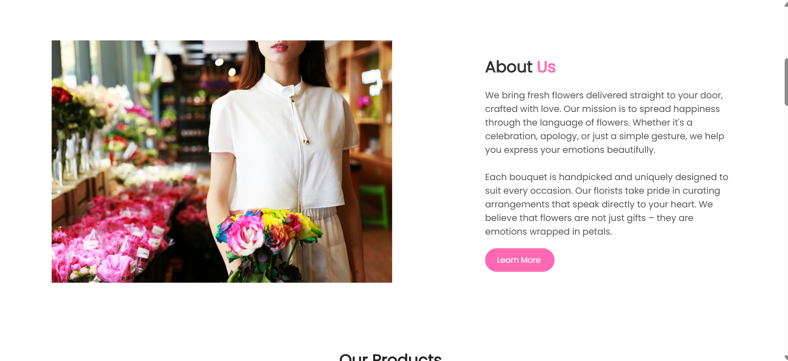
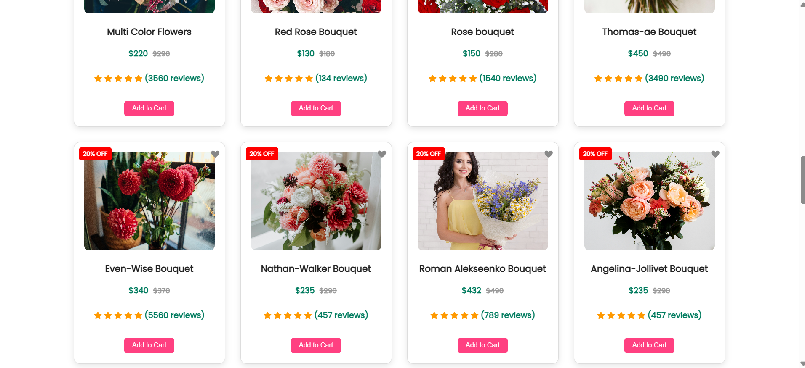
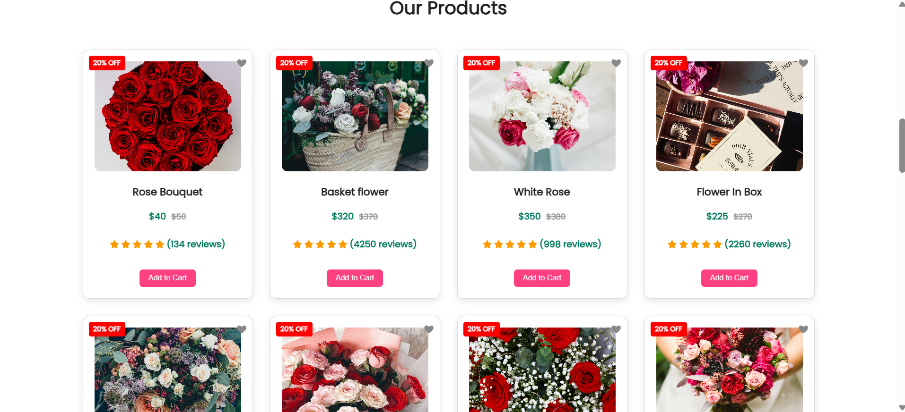
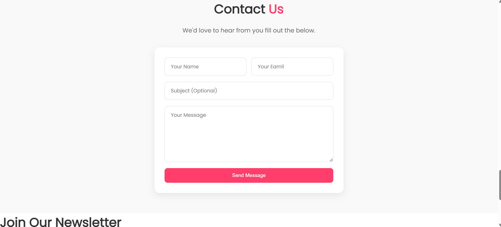
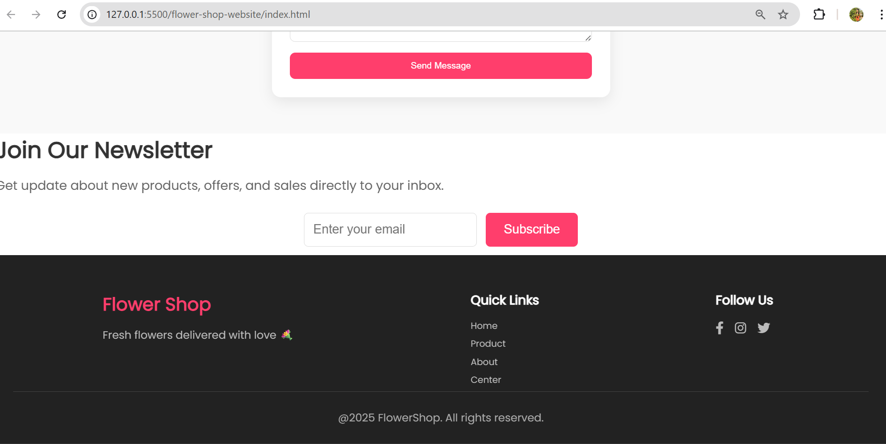

# 🌸 Flower Shop Website

A responsive and elegant flower shop website built using **HTML**, **CSS**, and **Vanilla JavaScript**.  
It includes a user-friendly interface, login/logout functionality, contact form with modern popup alerts, and responsive layouts for all devices.

---

## 📸 Screenshots

> Preview of different sections from the website

### 🏠 Home Section  


### 📖 About Section  


### 🛒 Product Section  


### 🛍️ Product List  


### 💬 Customer Reviews  


### ✉️ Contact Form  


### 🔚 Footer  


---

## 💡 Features

- 🌼 Clean and modern UI layout for a flower shop
- 📱 Fully responsive design for mobile, tablet, and desktop
- 🔐 **Login/Logout** system using `localStorage`
- 📩 **Contact Form** with:
  - Field validation
  - Modern **SweetAlert2** popup on success
  - Submit animation with `Sending...` text
- ✨ Smooth entrance animations (`fadeIn`) on sections
- 🎯 Section-based design: Home, About, Products, Reviews, Contact
- 🎨 Custom button styles, hover effects, and subtle shadows

---

## 🔧 Technologies Used

- HTML5
- CSS3 (Flexbox, animations, custom styling)
- JavaScript (DOM manipulation, form handling, localStorage)
- [SweetAlert2](https://sweetalert2.github.io/) – modern and user-friendly JavaScript alerts.


---

## 📁 Folder Structure


flower-shop-website/
│
├── index.html
├── login.html
├── signup.html
├── contact.html
├── style.css
├── script.js
├── images/
│ └── (all website images and icons)
├── screenshots/
│ ├── home.png
│ ├── about.png
│ ├── product.png
│ ├── product2.png
│ ├── review.png
│ ├── contact.png
│ └── footer.png
└── README.md

---

## 🚀 How to Run Locally

```bash
1. Clone the repository
   git clone https://github.com/Palak-Dwivedi20/flower-shop-website.git

2. Open the folder
   cd flower-shop-website

3. Run the project
   Open index.html in your browser (no server needed)

   🙋‍♀️ Author  
Made with 💗 by Palak Dwivedi.

